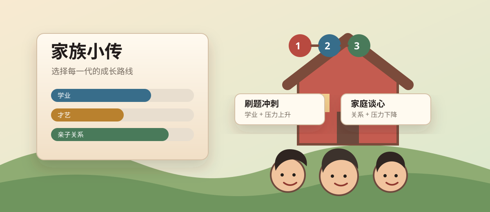

# 家族小传



《家族小传》是一款受“中国式成长”题材启发的轻量网页小游戏。你要陪一个孩子从童年走到成年，在成绩、才艺、社交、情绪、压力、亲子关系和家庭资源之间做取舍。每一代人的结局都会沉淀为家族特质，影响下一代的起点。

无需安装依赖，直接打开 [`index.html`](index.html) 就能玩。

## 怎么开始

1. 下载或克隆这个仓库。
2. 双击打开 `index.html`。
3. 从 1 岁开始，在页面中选择每年的成长安排。
4. 18 岁结束后查看成年结局，并点击“开启下一代”继续传承。

## 核心玩法

游戏按“代”推进。每一代会从 1 岁细致成长到 18 岁，每一岁都有自己的主题、文案、可选行动和自然成长结算：

| 年龄段 | 主题 |
| --- | --- |
| 1-3 岁 | 安全感、语言、入园适应和最早的亲子关系 |
| 4-6 岁 | 好奇心、习惯、幼小衔接和一年级作业 |
| 7-9 岁 | 学习习惯、兴趣分岔、排名与比较出现 |
| 10-12 岁 | 自尊、同伴、高年级压力和小升初选择 |
| 13-15 岁 | 初中适应、青春期空间和中考冲刺 |
| 16-18 岁 | 高中开局、方向选择和高考季结算 |

每一岁有 2 次行动机会。两次行动后会进入下一岁，并触发当岁的自然成长。行动结束后还可能触发随机家庭事件，比如老师表扬、家长群焦虑、家庭旅行、临时加班或一次争吵。

## 行动选择

| 行动 | 主要收益 | 代价或风险 |
| --- | --- | --- |
| 抱抱回应、睡前故事、家庭谈心 | 提升亲子关系和情绪 | 更偏长期收益 |
| 绘本、拼音、复习、学习方法、冲刺 | 提升学业 | 压力可能上升 |
| 乱画、乐器、社团、作品集 | 提升才艺 | 常会消耗家庭资源 |
| 公园、分享、朋友、辩论、实践 | 提升情商 | 不一定直接提升成绩 |
| 休息、运动、减压、考试心态 | 降低压力、恢复情绪 | 会占用冲刺时间 |
| 早教、衔接班、家教、竞赛路线 | 快速提升能力 | 资源与压力成本更高 |

游戏没有唯一正确答案。高学业能带来漂亮结局，但压力过高、亲子关系过低，也可能让孩子成年后和家庭渐行渐远。

## 属性说明

| 属性 | 作用 |
| --- | --- |
| 学业 | 影响升学与“稳稳上岸”类结局 |
| 才艺 | 影响兴趣路线和舞台型结局 |
| 情商 | 影响社交、生活能力和关系型结局 |
| 情绪 | 代表孩子的心理能量与复原力 |
| 压力 | 过高会拖累情绪、关系和成长稳定性 |
| 亲子关系 | 影响家庭支持感，也会成为下一代的家风 |
| 家庭资源 | 支撑训练、竞赛和下一代起点 |

## 代际传承

成年结算后，上一代的成长结果会转换为下一代的家族特质：

| 家族特质 | 来源 | 对下一代的影响 |
| --- | --- | --- |
| 书香 | 学业积累 | 学习行动收益更高 |
| 审美 | 才艺积累 | 才艺行动收益更高 |
| 人情 | 情商积累 | 社交行动收益更高 |
| 家底 | 家庭资源 | 下一代初始资源提高 |
| 家风 | 亲子关系 | 下一代初始关系更稳定、压力更低 |

这意味着每一代不是孤立的一局。上一代留下的能力、资源和家庭气质，会变成下一代的起跑线。

## 结局方向

游戏会根据成年时的各项属性生成结局，例如：

- 稳稳上岸的卷王
- 闪闪发光的偏科生
- 会生活的大人
- 普通但辽阔的人生
- 沉默的远行者
- 跌跌撞撞的毕业生

结局不是简单的“好”或“坏”。它更像一张家庭相册：有成就，也有遗憾；有被继承的优势，也有下一代可以重新理解的部分。

## 存档

页面右上角提供：

- `保存`：把当前家族进度存到浏览器本地。
- `读取`：读取上一次保存的进度。
- `重开`：清空本地存档，开始一个新家族。

存档使用浏览器 `localStorage`，不会上传到服务器。

## 项目结构

```text
.
├── index.html
├── README.md
└── assets/
    └── readme-cover.svg
```

## 后续可扩展方向

- 增加更多成长事件和家庭职业背景。
- 增加多子女、择校、家庭经济波动等长期系统。
- 增加更丰富的结局图鉴。
- 加入音效、阶段插画和移动端细节优化。
